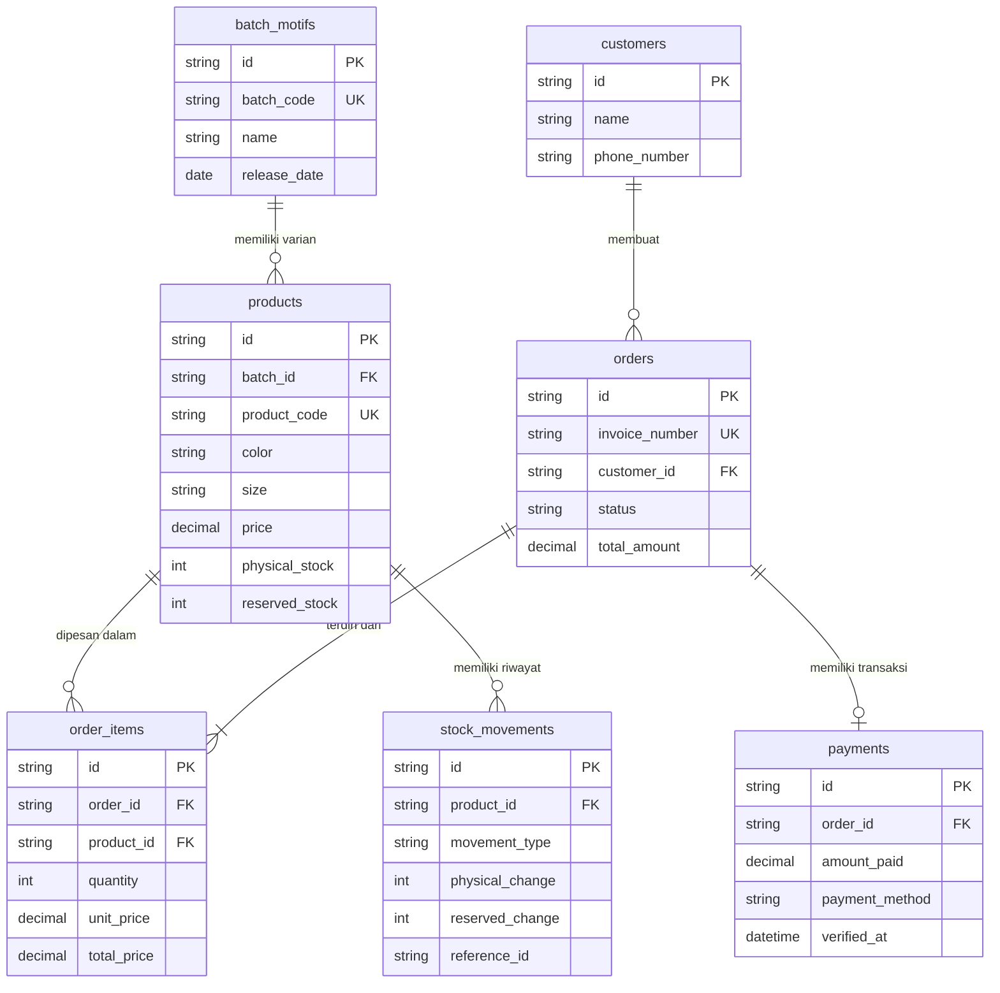

# Database Design: Bywell Closet Inventory

Dokumen ini mendeskripsikan perancangan basis data untuk aplikasi **Bywell Closet Inventory** berbasis SQLite / Relational Database (SQL) / In-Memory JSON store.

---

## 1. Daftar Tabel

1. **`batch_motifs`**: Menyimpan data master batch/koleksi motif hijab dan tanggal rilisnya.
2. **`products`**: Menyimpan data varian produk (SKU, warna, ukuran, harga, dan jumlah stok).
3. **`customers`**: Menyimpan data pelanggan (nama, nomor WhatsApp, alamat, dll).
4. **`orders`**: Menyimpan data transaksi pesanan utama (header order).
5. **`order_items`**: Menyimpan rincian produk yang dipesan dalam satu order (detail order).
6. **`payments`**: Menyimpan informasi pembayaran dan verifikasi bukti transfer.
7. **`stock_movements`**: Menyimpan log audit mutasi keluar-masuk stok fisik dan stok ditahan.

---

## 2. Struktur Kolom & Tipe Data

### 2.1. Tabel `batch_motifs`
| Nama Kolom | Tipe Data | Keterangan | Constraint |
|---|---|---|---|
| `id` | VARCHAR(36) / INTEGER | Primary Key (Unique Identifier Batch) | PRIMARY KEY, NOT NULL |
| `batch_code` | VARCHAR(50) | Kode unik batch (misal: `BATCH-2026-08`) | UNIQUE, NOT NULL |
| `name` | VARCHAR(100) | Nama Batch / Motif (misal: `Monogram Series`) | NOT NULL |
| `release_date` | DATE | Tanggal rilis / masuknya batch | NOT NULL |
| `description` | TEXT | Keterangan / deskripsi tambahan batch | NULLABLE |
| `created_at` | DATETIME | Waktu data dibuat | NOT NULL |
| `updated_at` | DATETIME | Waktu data terakhir diperbarui | NOT NULL |

### 2.2. Tabel `products`
| Nama Kolom | Tipe Data | Keterangan | Constraint |
|---|---|---|---|
| `id` | VARCHAR(36) / INTEGER | Primary Key (Product ID) | PRIMARY KEY, NOT NULL |
| `batch_id` | VARCHAR(36) / INTEGER | Foreign Key ke `batch_motifs.id` | FOREIGN KEY, NULLABLE |
| `product_code` | VARCHAR(50) | Kode SKU unik produk (misal: `BW80`, `BW90`) | UNIQUE, NOT NULL |
| `color` | VARCHAR(50) | Varian warna (misal: `Dusty Pink`, `Navy`) | NOT NULL |
| `size` | VARCHAR(50) | Ukuran (misal: `110x110`) | NOT NULL |
| `cost_price` | DECIMAL(12,2) | Harga modal / HPP per unit (Rupiah) | NOT NULL, DEFAULT 0, >= 0 |
| `price` | DECIMAL(12,2) | Harga jual eceran base (Rupiah) | NOT NULL, >= 0 |
| `image_url` | TEXT | URL / Path foto produk | NULLABLE |
| `physical_stock` | INTEGER | Stok fisik nyata di gudang | NOT NULL, DEFAULT 0, >= 0 |
| `reserved_stock` | INTEGER | Stok yang sedang ditahan (hold order) | NOT NULL, DEFAULT 0, >= 0 |
| `created_at` | DATETIME | Waktu produk ditambahkan | NOT NULL |
| `updated_at` | DATETIME | Waktu data produk diperbarui | NOT NULL |

> **Virtual Column (Computed):**  
> `available_stock` = `physical_stock - reserved_stock`

### 2.3. Tabel `customers`
| Nama Kolom | Tipe Data | Keterangan | Constraint |
|---|---|---|---|
| `id` | VARCHAR(36) / INTEGER | Primary Key Customer ID | PRIMARY KEY, NOT NULL |
| `name` | VARCHAR(100) | Nama Pelanggan (misal: `Kak Della`) | NOT NULL |
| `phone_number` | VARCHAR(20) | Nomor WhatsApp / Telepon | NULLABLE |
| `address` | TEXT | Alamat pengiriman | NULLABLE |
| `created_at` | DATETIME | Waktu data customer dibuat | NOT NULL |
| `updated_at` | DATETIME | Waktu data diperbarui | NOT NULL |

### 2.4. Tabel `orders`
| Nama Kolom | Tipe Data | Keterangan | Constraint |
|---|---|---|---|
| `id` | VARCHAR(36) / INTEGER | Primary Key Order ID | PRIMARY KEY, NOT NULL |
| `invoice_number` | VARCHAR(50) | Nomor Invoice unik (misal: `INV-20260804-0001`) | UNIQUE, NOT NULL |
| `customer_id` | VARCHAR(36) / INTEGER | Foreign Key ke `customers.id` | FOREIGN KEY, NOT NULL |
| `status` | VARCHAR(30) | Status terkini transaksi pesanan | ENUM / CHECK, NOT NULL |
| `subtotal` | DECIMAL(12,2) | Total harga produk sebelum diskon/ongkir | NOT NULL, >= 0 |
| `total_amount` | DECIMAL(12,2) | Total tagihan akhir | NOT NULL, >= 0 |
| `notes` | TEXT | Catatan order atau teks asli dari WhatsApp | NULLABLE |
| `created_at` | DATETIME | Tanggal & waktu pesanan dibuat | NOT NULL |
| `updated_at` | DATETIME | Waktu pembaruan status order | NOT NULL |

### 2.5. Tabel `order_items`
| Nama Kolom | Tipe Data | Keterangan | Constraint |
|---|---|---|---|
| `id` | VARCHAR(36) / INTEGER | Primary Key Order Item ID | PRIMARY KEY, NOT NULL |
| `order_id` | VARCHAR(36) / INTEGER | Foreign Key ke `orders.id` | FOREIGN KEY, NOT NULL |
| `product_id` | VARCHAR(36) / INTEGER | Foreign Key ke `products.id` | FOREIGN KEY, NOT NULL |
| `product_code` | VARCHAR(50) | Snapshot Kode Produk saat dipesan | NOT NULL |
| `quantity` | INTEGER | Jumlah unit yang dipesan | NOT NULL, > 0 |
| `unit_price` | DECIMAL(12,2) | Snapshot harga jual per unit saat order | NOT NULL, >= 0 |
| `total_price` | DECIMAL(12,2) | `quantity * unit_price` | NOT NULL, >= 0 |
| `created_at` | DATETIME | Tanggal item ditambahkan | NOT NULL |

### 2.6. Tabel `payments`
| Nama Kolom | Tipe Data | Keterangan | Constraint |
|---|---|---|---|
| `id` | VARCHAR(36) / INTEGER | Primary Key Payment ID | PRIMARY KEY, NOT NULL |
| `order_id` | VARCHAR(36) / INTEGER | Foreign Key ke `orders.id` | FOREIGN KEY, NOT NULL |
| `amount_paid` | DECIMAL(12,2) | Jumlah nominal pembayaran yang ditransfer | NOT NULL, >= 0 |
| `payment_method` | VARCHAR(50) | Metode pembayaran (BCA, Mandiri, Cash, dll) | NOT NULL |
| `payment_date` | DATETIME | Tanggal & waktu transfer dilakukan | NOT NULL |
| `proof_image_url` | TEXT | File/URL bukti transfer | NULLABLE |
| `verified_at` | DATETIME | Tanggal & waktu pembayaran diverifikasi | NULLABLE |
| `verified_by` | VARCHAR(50) | Admin yang melakukan verifikasi | NULLABLE |
| `created_at` | DATETIME | Waktu data pembayaran dibuat | NOT NULL |

### 2.7. Tabel `stock_movements`
| Nama Kolom | Tipe Data | Keterangan | Constraint |
|---|---|---|---|
| `id` | VARCHAR(36) / INTEGER | Primary Key Stock Movement ID | PRIMARY KEY, NOT NULL |
| `product_id` | VARCHAR(36) / INTEGER | Foreign Key ke `products.id` | FOREIGN KEY, NOT NULL |
| `movement_type` | VARCHAR(30) | Jenis mutasi stok | ENUM / CHECK, NOT NULL |
| `physical_change` | INTEGER | Perubahan pada Stok Fisik (+/-) | NOT NULL, DEFAULT 0 |
| `reserved_change` | INTEGER | Perubahan pada Stok Ditahan (+/-) | NOT NULL, DEFAULT 0 |
| `physical_before` | INTEGER | Snapshot Stok Fisik sebelum mutasi | NOT NULL |
| `physical_after` | INTEGER | Snapshot Stok Fisik setelah mutasi | NOT NULL |
| `reserved_before` | INTEGER | Snapshot Stok Ditahan sebelum mutasi | NOT NULL |
| `reserved_after` | INTEGER | Snapshot Stok Ditahan setelah mutasi | NOT NULL |
| `reference_type` | VARCHAR(50) | Jenis referensi (`order`, `stock_in`, `manual_adjustment`) | NULLABLE |
| `reference_id` | VARCHAR(50) | ID Referensi (`order_id`, `invoice_number`, dll) | NULLABLE |
| `notes` | TEXT | Catatan mutasi stok | NULLABLE |
| `created_at` | DATETIME | Waktu mutasi stok tercatat | NOT NULL |

---

## 3. Relasi Antar Tabel (Entity Relationships)



---

## 4. Status Order (Order Statuses)

1. **`waiting_payment`**: Order baru dibuat dari Paste Order WhatsApp. Stok dimasukkan ke status hold/reserved.
2. **`payment_uploaded`**: Admin/customer mengunggah bukti transfer, menunggu verifikasi.
3. **`paid`**: Pembayaran telah diverifikasi oleh admin. Stok fisik berkurang dan stok ditahan dilepas.
4. **`processing`**: Pesanan sedang disiapkan / dipacking.
5. **`shipped`**: Pesanan telah dikirim ke kurir / ekspedisi.
6. **`completed`**: Pesanan telah selesai dan diterima oleh pelanggan.
7. **`cancelled`**: Pesanan dibatalkan (oleh admin/customer). Stok ditahan dilepas kembali ke stok tersedia.
8. **`expired`**: Pesanan kadaluarsa karena batas waktu pembayaran habis. Stok ditahan dilepas.

---

## 5. Jenis Mutasi Stok (Stock Movement Types)

1. **`stock_in`**: Penambahan stok fisik dari produksi/supplier (+physical_stock).
2. **`reservation`**: Penahanan stok saat order baru dibuat (+reserved_stock).
3. **`reservation_release`**: Pelepasan stok ditahan saat order dibatalkan/expired (-reserved_stock).
4. **`sale`**: Penjualan terverifikasi (-physical_stock & -reserved_stock bersamaan).
5. **`adjustment`**: Penyesuaian stok manual akibat selisih opname/barang rusak.
6. **`return`**: Pengembalian barang dari customer (+physical_stock).

---

## 6. Aturan Perhitungan Stok

$$\text{available\_stock} = \text{physical\_stock} - \text{reserved\_stock}$$

---

## 7. Aturan Transaksi & Integrasi Stok

1. **Order Baru (`waiting_payment`)**:
   - Menambah `reserved_stock` sejumlah `quantity` pesanan.
   - `physical_stock` TIDAK berkurang.
   - `available_stock` berkurang secara otomatis.
   - Dicatat di `stock_movements` dengan `movement_type = 'reservation'`.

2. **Pembayaran Diverifikasi (`paid`)**:
   - Mengurangi `physical_stock` sejumlah `quantity`.
   - Mengurangi/Melepas `reserved_stock` sejumlah `quantity`.
   - `available_stock` nilainya tetap konstan saat perubahan ini terjadi.
   - Dicatat di `stock_movements` dengan `movement_type = 'sale'`.

3. **Pembatalan / Expired Order (`cancelled` / `expired`)**:
   - Mengurangi/Melepas `reserved_stock` sejumlah `quantity`.
   - `physical_stock` TIDAK berubah.
   - `available_stock` bertambah kembali seperti sebelum order dibuat.
   - Dicatat di `stock_movements` dengan `movement_type = 'reservation_release'`.

4. **Validasi Stok Tidak Boleh Negatif**:
   - `physical_stock >= 0`
   - `reserved_stock >= 0`
   - `available_stock >= 0` (Saat membuat order baru, jika `quantity > available_stock`, transaksi HARUS ditolak/peringatan stok tidak cukup).

5. **Log Mutasi Wajib**:
   - Setiap transaksi yang mempengaruhi `physical_stock` atau `reserved_stock` WAJIB membuat 1 record log baru di tabel `stock_movements`.

---

## 8. Contoh Data Transaksi (Sample Data)

### 8.1. Data `batch_motifs`
```json
[
  {
    "id": "batch-001",
    "batch_code": "BATCH-MONOGRAM",
    "name": "Monogram Series",
    "release_date": "2026-08-01",
    "description": "Koleksi Monogram Motif Premium Agustus 2026",
    "created_at": "2026-08-01T08:00:00Z",
    "updated_at": "2026-08-01T08:00:00Z"
  }
]
```

### 8.2. Data `products` (BW80 dan BW90)
```json
[
  {
    "id": "prod-bw80",
    "batch_id": "batch-001",
    "product_code": "BW80",
    "color": "Dusty Pink",
    "size": "110x110",
    "price": 85000.00,
    "image_url": "/images/bw80.jpg",
    "physical_stock": 20,
    "reserved_stock": 1,
    "available_stock": 19,
    "created_at": "2026-08-01T09:00:00Z",
    "updated_at": "2026-08-04T10:00:00Z"
  },
  {
    "id": "prod-bw90",
    "batch_id": "batch-001",
    "product_code": "BW90",
    "color": "Navy",
    "size": "110x110",
    "price": 95000.00,
    "image_url": "/images/bw90.jpg",
    "physical_stock": 15,
    "reserved_stock": 2,
    "available_stock": 13,
    "created_at": "2026-08-01T09:00:00Z",
    "updated_at": "2026-08-04T10:00:00Z"
  }
]
```

### 8.3. Data `customers` (Kak Della)
```json
[
  {
    "id": "cust-della",
    "name": "Kak Della",
    "phone_number": "081234567890",
    "address": "Jl. Mawar No. 12, Jakarta",
    "created_at": "2026-08-04T10:00:00Z",
    "updated_at": "2026-08-04T10:00:00Z"
  }
]
```

### 8.4. Data `orders` & `order_items` (Order Kak Della: BW80 Qty 1, BW90 Qty 2)

**Tabel `orders`:**
```json
[
  {
    "id": "ord-20260804-001",
    "invoice_number": "INV-20260804-0001",
    "customer_id": "cust-della",
    "status": "waiting_payment",
    "subtotal": 275000.00,
    "total_amount": 275000.00,
    "notes": "*KAK DELLA*\nBW80(1)\nBW90(2)",
    "created_at": "2026-08-04T10:00:00Z",
    "updated_at": "2026-08-04T10:00:00Z"
  }
]
```

**Tabel `order_items`:**
```json
[
  {
    "id": "item-001",
    "order_id": "ord-20260804-001",
    "product_id": "prod-bw80",
    "product_code": "BW80",
    "quantity": 1,
    "unit_price": 85000.00,
    "total_price": 85000.00,
    "created_at": "2026-08-04T10:00:00Z"
  },
  {
    "id": "item-002",
    "order_id": "ord-20260804-001",
    "product_id": "prod-bw90",
    "product_code": "BW90",
    "quantity": 2,
    "unit_price": 95000.00,
    "total_price": 190000.00,
    "created_at": "2026-08-04T10:00:00Z"
  }
]
```

### 8.5. Data `stock_movements` (Saat Order Dibuat)
```json
[
  {
    "id": "mov-001",
    "product_id": "prod-bw80",
    "movement_type": "reservation",
    "physical_change": 0,
    "reserved_change": 1,
    "physical_before": 20,
    "physical_after": 20,
    "reserved_before": 0,
    "reserved_after": 1,
    "reference_type": "order",
    "reference_id": "INV-20260804-0001",
    "notes": "Stok ditahan untuk order KAK DELLA (BW80 x1)",
    "created_at": "2026-08-04T10:00:00Z"
  },
  {
    "id": "mov-002",
    "product_id": "prod-bw90",
    "movement_type": "reservation",
    "physical_change": 0,
    "reserved_change": 2,
    "physical_before": 15,
    "physical_after": 15,
    "reserved_before": 0,
    "reserved_after": 2,
    "reference_type": "order",
    "reference_id": "INV-20260804-0001",
    "notes": "Stok ditahan untuk order KAK DELLA (BW90 x2)",
    "created_at": "2026-08-04T10:00:00Z"
  }
]
```

---

## 9. Skrip Supabase PostgreSQL DDL (SQL Migration)

Dapat langsung dijalankan pada **Supabase SQL Editor**:

```sql
-- Enable UUID extension
CREATE EXTENSION IF NOT EXISTS "uuid-ossp";

-- 1. Table: batch_motifs
CREATE TABLE IF NOT EXISTS batch_motifs (
    id UUID PRIMARY KEY DEFAULT uuid_generate_v4(),
    batch_code VARCHAR(50) UNIQUE NOT NULL,
    name VARCHAR(100) NOT NULL,
    release_date DATE NOT NULL,
    description TEXT,
    created_at TIMESTAMP WITH TIME ZONE DEFAULT NOW(),
    updated_at TIMESTAMP WITH TIME ZONE DEFAULT NOW()
);

-- 2. Table: products
CREATE TABLE IF NOT EXISTS products (
    id UUID PRIMARY KEY DEFAULT uuid_generate_v4(),
    batch_id UUID REFERENCES batch_motifs(id) ON DELETE SET NULL,
    product_code VARCHAR(50) UNIQUE NOT NULL,
    color VARCHAR(50) NOT NULL,
    size VARCHAR(50) NOT NULL,
    price DECIMAL(12,2) NOT NULL CHECK (price >= 0),
    image_url TEXT,
    physical_stock INT NOT NULL DEFAULT 0 CHECK (physical_stock >= 0),
    reserved_stock INT NOT NULL DEFAULT 0 CHECK (reserved_stock >= 0),
    available_stock INT GENERATED ALWAYS AS (physical_stock - reserved_stock) STORED,
    created_at TIMESTAMP WITH TIME ZONE DEFAULT NOW(),
    updated_at TIMESTAMP WITH TIME ZONE DEFAULT NOW(),
    CONSTRAINT available_stock_non_negative CHECK (physical_stock >= reserved_stock)
);

-- 3. Table: customers
CREATE TABLE IF NOT EXISTS customers (
    id UUID PRIMARY KEY DEFAULT uuid_generate_v4(),
    name VARCHAR(100) NOT NULL,
    phone_number VARCHAR(20),
    address TEXT,
    created_at TIMESTAMP WITH TIME ZONE DEFAULT NOW(),
    updated_at TIMESTAMP WITH TIME ZONE DEFAULT NOW()
);

-- 4. Table: orders
CREATE TABLE IF NOT EXISTS orders (
    id UUID PRIMARY KEY DEFAULT uuid_generate_v4(),
    invoice_number VARCHAR(50) UNIQUE NOT NULL,
    customer_id UUID REFERENCES customers(id) ON DELETE RESTRICT,
    status VARCHAR(30) NOT NULL DEFAULT 'waiting_payment' CHECK (
        status IN ('waiting_payment', 'payment_uploaded', 'paid', 'processing', 'shipped', 'completed', 'cancelled', 'expired')
    ),
    subtotal DECIMAL(12,2) NOT NULL DEFAULT 0 CHECK (subtotal >= 0),
    total_amount DECIMAL(12,2) NOT NULL DEFAULT 0 CHECK (total_amount >= 0),
    notes TEXT,
    created_at TIMESTAMP WITH TIME ZONE DEFAULT NOW(),
    updated_at TIMESTAMP WITH TIME ZONE DEFAULT NOW()
);

-- 5. Table: order_items
CREATE TABLE IF NOT EXISTS order_items (
    id UUID PRIMARY KEY DEFAULT uuid_generate_v4(),
    order_id UUID NOT NULL REFERENCES orders(id) ON DELETE CASCADE,
    product_id UUID NOT NULL REFERENCES products(id) ON DELETE RESTRICT,
    product_code VARCHAR(50) NOT NULL,
    quantity INT NOT NULL CHECK (quantity > 0),
    unit_price DECIMAL(12,2) NOT NULL CHECK (unit_price >= 0),
    total_price DECIMAL(12,2) NOT NULL CHECK (total_price >= 0),
    created_at TIMESTAMP WITH TIME ZONE DEFAULT NOW()
);

-- 6. Table: payments
CREATE TABLE IF NOT EXISTS payments (
    id UUID PRIMARY KEY DEFAULT uuid_generate_v4(),
    order_id UUID NOT NULL REFERENCES orders(id) ON DELETE CASCADE,
    amount_paid DECIMAL(12,2) NOT NULL CHECK (amount_paid >= 0),
    payment_method VARCHAR(50) NOT NULL,
    payment_date TIMESTAMP WITH TIME ZONE NOT NULL DEFAULT NOW(),
    proof_image_url TEXT,
    verified_at TIMESTAMP WITH TIME ZONE,
    verified_by VARCHAR(50),
    created_at TIMESTAMP WITH TIME ZONE DEFAULT NOW()
);

-- 7. Table: stock_movements
CREATE TABLE IF NOT EXISTS stock_movements (
    id UUID PRIMARY KEY DEFAULT uuid_generate_v4(),
    product_id UUID NOT NULL REFERENCES products(id) ON DELETE CASCADE,
    movement_type VARCHAR(30) NOT NULL CHECK (
        movement_type IN ('stock_in', 'reservation', 'reservation_release', 'sale', 'adjustment', 'return')
    ),
    physical_change INT NOT NULL DEFAULT 0,
    reserved_change INT NOT NULL DEFAULT 0,
    physical_before INT NOT NULL,
    physical_after INT NOT NULL,
    reserved_before INT NOT NULL,
    reserved_after INT NOT NULL,
    reference_type VARCHAR(50),
    reference_id VARCHAR(50),
    notes TEXT,
    created_at TIMESTAMP WITH TIME ZONE DEFAULT NOW()
);

-- Indeks untuk mengoptimalkan performa pencarian
CREATE INDEX IF NOT EXISTS idx_products_code ON products(product_code);
CREATE INDEX IF NOT EXISTS idx_orders_status ON orders(status);
CREATE INDEX IF NOT EXISTS idx_stock_movements_product ON stock_movements(product_id);
```

