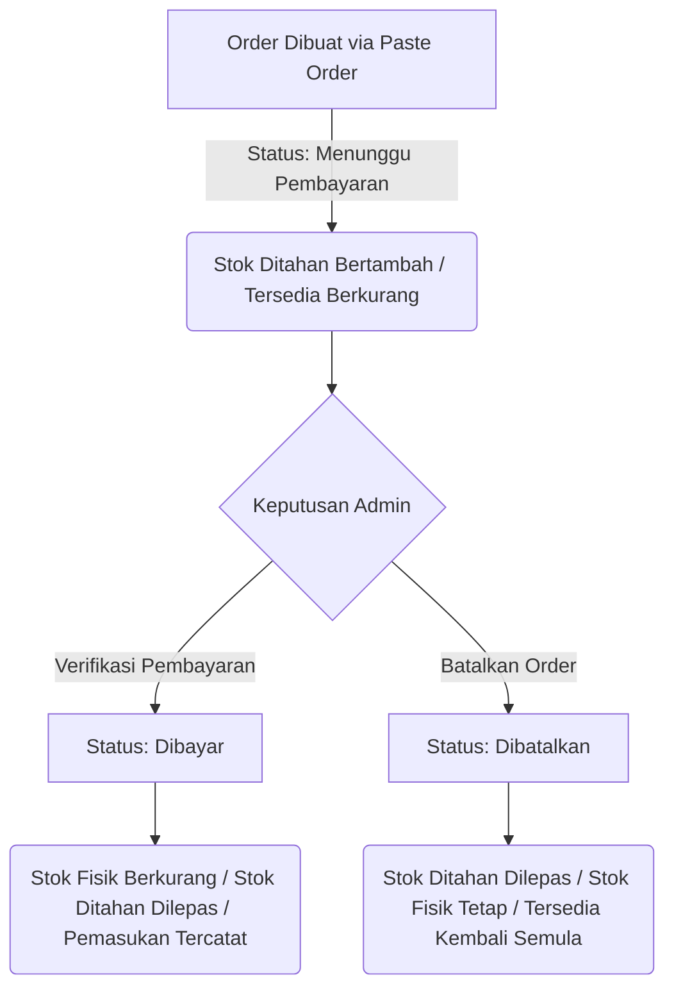

# Requirements Specification: Bywell Closet Inventory MVP

## 1. Pendahuluan
Bywell Closet Inventory adalah aplikasi manajemen stok (inventory) berbasis web yang dirancang khusus untuk bisnis hijab Bywell Closet. Aplikasi ini bertujuan menggantikan pencatatan stok manual di spreadsheet dan mempermudah pemrosesan pesanan yang masuk melalui WhatsApp.

---

## 2. Struktur Menu & Halaman
Aplikasi akan memiliki menu navigasi sebagai berikut:
- **Dashboard**: Menampilkan ringkasan informasi penting seperti total produk, stok fisik, stok tersedia (available), jumlah pesanan menunggu pembayaran, jumlah pesanan dibayar, dan ringkasan penjualan.
- **Master Batch & Produk**: Manajemen data Master Batch Motif (koleksi & tanggal rilis) serta varian produk (kode produk/SKU, warna, ukuran, harga, stok).
- **Stok Masuk**: Form dan log untuk menambah stok fisik produk yang sudah terdaftar.
- **Paste Order**: Halaman khusus untuk menempelkan (paste) teks pesanan dari WhatsApp, memprosesnya (parsing), dan melakukan preview pesanan.
- **Daftar Order**: Halaman untuk melihat semua pesanan, mengelola status pembayaran (verifikasi bukti transfer), dan membatalkan pesanan.
- **Riwayat Stok**: Halaman log aktivitas keluar-masuk stok untuk kebutuhan audit dan pelacakan.

---

## 3. Spesifikasi Fungsional

### 3.1. Master Batch Motif & Produk (Varian)
Pencatatan produk terbagi menjadi 2 tingkatan relasi: **Master Batch Motif** dan **Varian Produk (SKU)**.

#### A. Master Batch Motif
Manajemen koleksi/batch motif yang dirilis secara berkala:
- **ID / Kode Batch** (Contoh: `BATCH-2026-08`, `BATCH-MONOGRAM`)
- **Nama Batch / Motif** (Contoh: `Monogram Series`, `Flora Edition`)
- **Tanggal Rilis / Tanggal Batch** (Tanggal rilis/masuknya batch motif ini, contoh: `04/08/2026`)
- **Keterangan / Deskripsi Batch** (Catatan tambahan mengenai koleksi ini)

#### B. Varian Produk (SKU)
Setiap produk turunan dari Batch Motif memiliki atribut:
- **Master Batch Motif** (Terhubung ke Master Batch Motif terkait)
- **Kode Produk (SKU)** (Unique, contoh: `BW80`, `BW81`)
- **Warna** (Contoh: `Dusty Pink`, `Navy`, `Black`)
- **Ukuran** (Contoh: `110x110`, `120x120`)
- **Harga Modal / HPP** (Harga pokok pembelian dari konveksi/supplier dalam Rupiah, untuk menghitung profit bersih)
- **Harga Jual Eceran Base** (Harga eceran standar per unit)
- **Foto Produk** (File gambar spesifik varian/motif)
- **Stok Fisik** (Jumlah riil barang di gudang)
- **Stok Ditahan (Reserved Stock)** (Jumlah barang yang dipesan tetapi belum dibayar)
- **Stok Tersedia (Available Stock)** (Stok siap jual, dihitung otomatis)

#### C. Skema Harga Reseller / Grosir Bertingkat (Tier Pricing)
Sistem secara otomatis menghitung harga satuan barang berdasarkan **Total Kuantitas Order (Bebas Mix Motif)** dalam satu pesanan sesuai tabel berikut:

| Rentang Kuantitas (PCS) | Harga Satuan (Rp/PCS) | Keterangan |
|---|---|---|
| 0 - 5 PCS | Rp 42.000 | Eceran Standar |
| 6 - 10 PCS | Rp 39.000 | Tier 1 Reseller |
| 11 - 19 PCS | Rp 36.000 | Tier 2 Reseller |
| 20 - 49 PCS | Rp 32.500 | Tier 3 Reseller |
| 50 - 99 PCS | Rp 31.000 | Tier 4 Reseller |
| 100 - 199 PCS | Rp 30.000 | Tier 5 Reseller |
| 200 - 500 PCS | Rp 28.500 | Tier 6 Reseller |
| 501 - 999 PCS | Rp 27.500 | Tier 7 Reseller |
| $\ge$ 1000 PCS | Rp 26.000 | Tier Distributor Utama |

*Catatan:*
- **Bebas Mix Motif**: Penentuan tier dihitung dari total jumlah unit seluruh item yang dipesan dalam satu order.
- **Tanpa Minimum Order per Motif**: Setiap varian SKU mengikuti harga tier total kuantitas order.

**Aturan Perhitungan Stok:**
$$\text{Stok Tersedia} = \text{Stok Fisik} - \text{Stok Ditahan}$$

### 3.2. Stok Masuk (Stock In)
Proses penambahan stok fisik untuk produk yang sudah ada:
- **Input data**: Pilih produk (berdasarkan kode/nama), jumlah masuk, tanggal masuk, dan catatan tambahan (misal: "Restock supplier", "Retur barang").
- **Dampak**: Menambah **Stok Fisik** dari produk yang dipilih dan mencatat entri baru ke **Riwayat Stok**.

### 3.3. Paste Order WhatsApp
Admin dapat menempelkan teks salinan pesanan dari WhatsApp untuk diproses secara otomatis oleh sistem.

* **Format Teks Input (Contoh):**
  ```text
  *KAK DELLA*
  BW80(1)
  BW90(2)
  ```
* **Aturan Parsing:**
  - Baris pertama (atau teks di dalam bintang `*`) dibaca sebagai **Nama Customer**.
  - Baris-baris berikutnya yang memiliki format `KODE_PRODUK(JUMLAH)` dibaca sebagai item pesanan. Contoh: `BW80(1)` diartikan sebagai Produk `BW80` sebanyak `1` unit.
* **Preview & Edit Order:**
  - Setelah teks diparse, sistem harus menampilkan halaman preview order.
  - Admin dapat memverifikasi kesesuaian produk (jika kode produk tidak terdaftar, tampilkan peringatan).
  - Admin dapat mengedit Nama Customer, mengubah jumlah barang, menghapus item pesanan, atau menambahkan item baru sebelum disimpan ke database.

### 3.4. Manajemen Status Order & Alur Stok



#### A. Pembelian Baru (Menunggu Pembayaran)
- Status Order: **Menunggu Pembayaran**
- **Dampak Stok**:
  - Stok Fisik: *Tetap* (tidak berkurang).
  - Stok Ditahan (Reserved): *Bertambah* sesuai jumlah pesanan.
  - Stok Tersedia (Available): *Berkurang* secara otomatis.

#### B. Pembayaran & Verifikasi Pembayaran
- Admin mengunggah bukti transfer, memasukkan nominal pembayaran, tanggal pembayaran, dan memilih metode pembayaran (contoh: BCA, Mandiri, GoPay).
- Admin menekan tombol **Verifikasi Pembayaran**.
- Status Order berubah menjadi: **Dibayar**
- **Dampak Stok & Keuangan**:
  - Stok Fisik: *Berkurang* sesuai jumlah pesanan.
  - Stok Ditahan (Reserved): *Berkurang/Dilepas* sesuai jumlah pesanan.
  - Stok Tersedia (Available): *Tetap* (karena pengurangan Stok Fisik dan Stok Ditahan bernilai sama).
  - Mencatat nominal pembayaran sebagai pemasukan penjualan.

#### C. Pembatalan Order
- Admin menekan tombol **Batalkan Order** pada pesanan yang belum dibayar.
- Status Order berubah menjadi: **Dibatalkan**
- **Dampak Stok**:
  - Stok Ditahan (Reserved): *Berkurang/Dilepas* sesuai jumlah pesanan.
  - Stok Fisik: *Tetap*.
  - Stok Tersedia (Available): *Bertambah kembali* ke jumlah semula.

### 3.5. Pembuatan Invoice
Sistem secara otomatis menghasilkan Invoice setelah pesanan disimpan:
- **Nomor Invoice**: Dihasilkan secara otomatis dan berurutan (misal: `INV-20260804-0001`).
### 3.6. Pencatatan Keuangan & Laporan Laba Rugi Sebulan (Financial Management & Profit Tracking)
Fitur untuk mencatat transaksi kas (uang masuk & uang keluar) serta menghitung profit bersih bulanan secara otomatis:

#### A. Pencatatan Mutasi Kas (Uang Masuk & Uang Keluar)
- **Uang Masuk (Cash In)**:
  - Otomatis tercatat saat status order berubah menjadi **Dibayar (PAID)**.
  - Opsi pencatatan Uang Masuk manual (misal: penambahan modal, penjualan offline langsung, dll).
- **Uang Keluar (Cash Out)**:
  - Pencatatan pengeluaran operasional (pembelian bahan/stok hijab, biaya konveksi, packaging, ekspedisi/ongkir, gaji, promo/iklan, dll).
  - Kategori pengeluaran, tanggal, nominal, dan catatan.

#### B. Rumus Kalkulasi Profit Bersih Sebulan
$$\text{Laba Kotor} = \text{Total Uang Masuk (Penjualan)} - \text{Total HPP (Modal Barang Terjual)}$$

$$\text{Laba Bersih / Profit Sebulan} = \text{Laba Kotor} - \text{Total Uang Keluar (Pengeluaran Operasional)}$$

---

## 4. Riwayat Stok (Stock History)
Mencatat setiap mutasi stok yang terjadi dalam sistem dengan kolom:
- Tanggal & Waktu
- Kode Produk
- Jenis Transaksi (Stok Masuk / Pesanan Dibuat / Pembayaran Terverifikasi / Pesanan Dibatalkan)
- Jumlah Perubahan (misal: +10, -2, dll)
- Keterangan / Referensi (Catatan stok masuk atau ID/Nomor Invoice pesanan)

---

## 5. Rencana Teknis & Arsitektur Sistem
- **Framework**: Next.js (App Router, TypeScript)
- **Backend / API**: Next.js Server Actions & Route Handlers
- **Database**: Supabase PostgreSQL
- **Storage**: Supabase Storage (Bucket: `product-images`, `payment-proofs`)
- **Styling**: Tailwind CSS
- **Deployment**: Vercel
- **Keamanan & Konsistensi Stok**: Menggunakan Supabase Database Transactions / RPC (Stored Procedures) untuk memastikan pembaruan stok bersifat atomik (race-condition safe).
